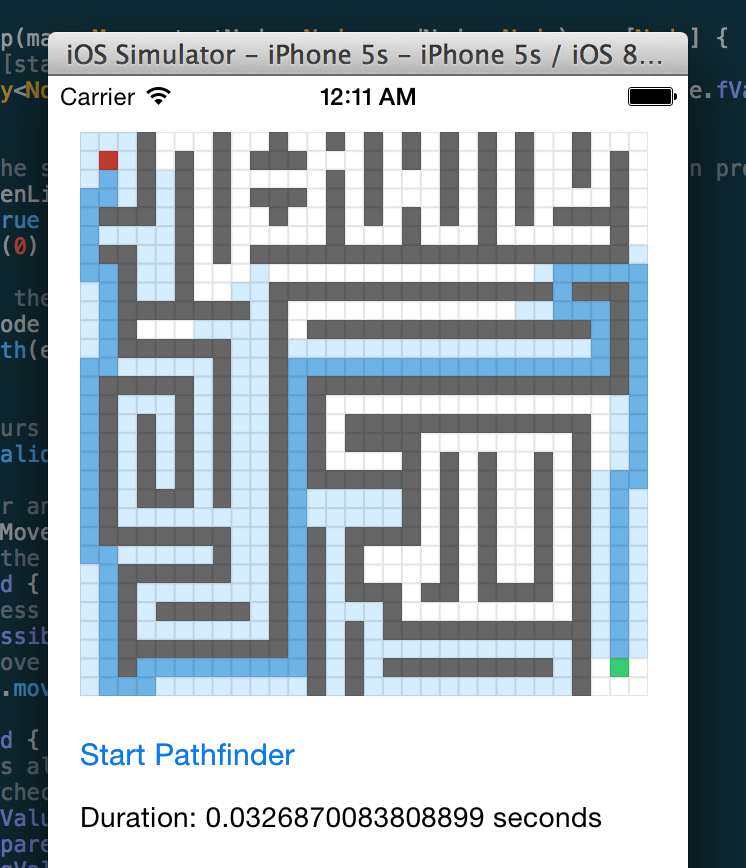
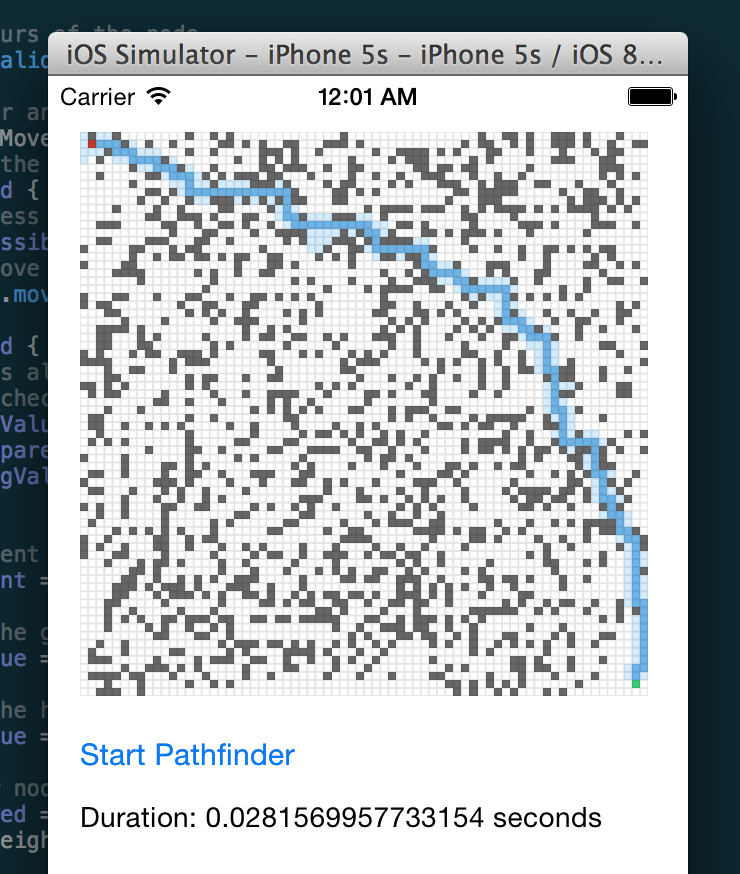

Pathfinder
==========

Pathfinder is a pathfinding library written in Swift.

## Work in progress!
This library is work in progress! It's not ready for the real world yet!

## Usage
Soon.

## Future
- 3D Map support
- More algorithms

## Things to note
- Best performance is achieved when using the Release Build Configuration
- I have not tested this on an iPhone 

## License
Pathfinder is available under the MIT license. See the LICENSE file for more info.